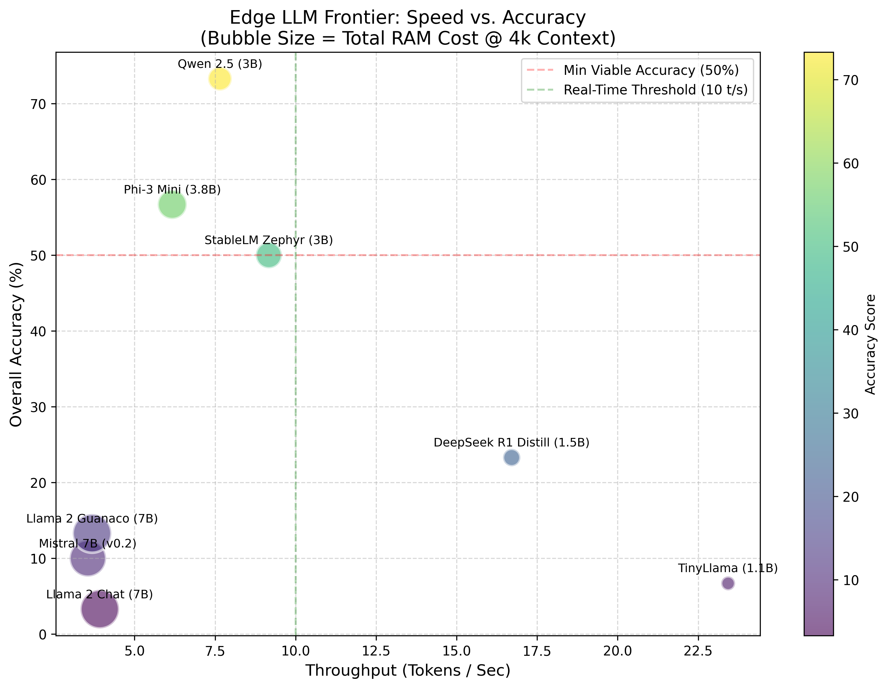

# CPU Inference Benchmark Suite

A Multi-Dimensional Evaluation of 8 Large Language Models on Commodity Cloud CPUs

---

## Overview

This repository provides a complete, reproducible evaluation of eight state-of-the-art Large Language Models (LLMs) under **CPU-only** conditions. The objective is to determine which architectures offer the most favorable balance between:

* computational cost
* reasoning accuracy
* coding correctness
* RAM requirements
* real-time throughput
* general robustness under quantization

The entire benchmark stack is implemented in Python using `llama.cpp` backends and GGUF quantized models. All tests load each model once and run a uniform set of deterministic evaluations.

This project is designed to model real constraints encountered when deploying LLMs onto low-cost VMs, edge servers, automation systems, and offline inference environments.

---

## Hardware and Environment

 - **Machine:** Azure Standard_D4s_v5
 - **CPU:** 4 vCPU Intel Xeon Platinum 8171M
 - **RAM:** 16 GiB
 - **Instruction Set:** AVX2, FMA
 - **Operating System:** Ubuntu 22.04
 - **Backend:** llama.cpp (GGUF)
 - **Quantization:** Q4_K_M for all models
 - **Context Length:** 4096 tokens
 - **Cost:** ~ $0.19/hour (~ $0.04 with Spot instance)

The environment is intentionally constrained to simulate cost-efficient production deployment scenarios.

---

## Models Evaluated

Each model is evaluated in Q4_K_M GGUF format:

| Key            | Model Name               |
| -------------- | ------------------------ |
| deepseek       | DeepSeek R1 Distill 1.5B |
| phi3           | Phi-3 Mini 3.8B          |
| mistral        | Mistral-7B Instruct v0.2 |
| qwen           | Qwen 2.5 3B              |
| llama2_chat    | Llama 2 7B Chat          |
| llama2_guanaco | Llama 2 7B Guanaco       |
| zephyr         | StableLM Zephyr 3B       |
| tinyllama      | TinyLlama 1.1B           |

---


*Figure 1: Efficiency Frontier. Qwen 2.5 (3B) dominates the high-accuracy quadrant, while TinyLlama defines the speed ceiling.*

---

## Benchmark Methodology

Each model undergoes four independent analyses:

### 1. Coding Accuracy Benchmark

The test suite includes deterministic coding tasks:

* function definition correctness
* JSON generation
* bash commands
* fixing syntactic errors

Evaluation logic uses exact-match or strict pattern-match scoring.
Temperature is set to `0.0` to force deterministic, reproducible decoding.

**Metric:**
`Coding Accuracy (%)` = (correct coding outputs / coding tests) × 100

---

### 2. Reasoning and Math Benchmark

Tasks include:

* arithmetic
* logical induction
* classification by rule
* context-dependent inference

These tasks measure the model's internal consistency and symbolic manipulation capability.

**Metric:**
`Reasoning Accuracy (%)` = (correct reasoning outputs / reasoning tests) × 100

---

### 3. General Chat Benchmark

Simple factual and linguistic transformations:

* capital identification
* common scientific terms
* textual transformations
* general understanding

**Metric:**
`Chat Accuracy (%)` = (correct chat outputs / chat tests) × 100

---

### 4. Throughput (Tokens/Sec)

Measured using a fixed deterministic generation prompt on `n_threads=4`.
The target metric is the sustained output rate after warm-up.

**Metric:**
`Speed (t/s)` = tokens generated per second, reported by llama.cpp

---

### 5. Static RAM Footprint

Measured immediately after loading the model into memory:

`Static RAM = process_rss_after_load − process_rss_before_load`

This represents the cost of loading model weights.

---

### 6. KV-Cache Growth

A long-context test extends a session with sequential tokens.

**Metric:**
`KV Growth (MB)` = additional RAM consumption from generating 1000 tokens

Total RAM requirement for a 4096-token context is:

`Total_RAM(4k) = Static_RAM + (KV_Growth × 4 / 1024)`

This captures long-context cost.

---

## Final Outputs Collected

For each model, the benchmark suite reports:

* speed (tokens/sec)
* coding accuracy
* reasoning accuracy
* chat accuracy
* overall accuracy
* static RAM
* KV-cache growth
* total RAM required for 4k context

All results are consolidated into:

* sorted leaderboards per use-case
* complete raw tables of all metrics

---

# Final Benchmark Results (8 Models)

Below are the raw, observed results from VM.

---

## Coding-Focused Ranking

Sorted by coding accuracy, breaking ties by speed.

| Model                      | Coding Acc | Speed     |
| -------------------------- | ---------- | --------- |
| Qwen 2.5 (3B)              | 60%        | 8.37 t/s  |
| Phi-3 Mini (3.8B)          | 40%        | 6.37 t/s  |
| StableLM Zephyr (3B)       | 30%        | 9.95 t/s  |
| DeepSeek R1 Distill (1.5B) | 20%        | 17.07 t/s |
| Llama 2 Guanaco (7B)       | 10%        | 3.8 t/s   |
| TinyLlama (1.1B)           | 0%         | 24.88 t/s |
| Llama 2 Chat (7B)          | 0%         | 4.06 t/s  |
| Mistral 7B (v0.2)          | 0%         | 3.64 t/s  |

**Winner (Coding): Qwen 2.5 (3B)**
Balanced accuracy and speed with low RAM.

---

## Reasoning-Focused Ranking

Sorted by reasoning accuracy, then speed.

| Model                      | Reasoning Acc | Speed     |
| -------------------------- | ------------- | --------- |
| Qwen 2.5 (3B)              | 80%           | 8.37 t/s  |
| Phi-3 Mini (3.8B)          | 70%           | 6.37 t/s  |
| StableLM Zephyr (3B)       | 50%           | 9.95 t/s  |
| DeepSeek R1 Distill (1.5B) | 30%           | 17.07 t/s |
| TinyLlama (1.1B)           | 10%           | 24.88 t/s |
| Llama 2 Guanaco (7B)       | 10%           | 3.8 t/s   |
| Llama 2 Chat (7B)          | 0%            | 4.06 t/s  |
| Mistral 7B (v0.2)          | 0%            | 3.64 t/s  |

**Winner (Reasoning): Qwen 2.5 (3B)**

---

## Low Hardware / RAM-Constrained Ranking

Sorted by RAM requirement, then accuracy.

| Model                | RAM (4k) | Acc   |
| -------------------- | -------- | ----- |
| TinyLlama (1.1B)     | 1.15 GB  | 6.7%  |
| DeepSeek 1.5B        | 1.77 GB  | 23.3% |
| Qwen 2.5 (3B)        | 3.33 GB  | 73.3% |
| StableLM Zephyr (3B) | 3.97 GB  | 50%   |
| Phi-3 Mini (3.8B)    | 4.94 GB  | 56.7% |
| Mistral 7B           | 7.7 GB   | 10%   |
| Llama 2 Guanaco      | 8.67 GB  | 13.3% |
| Llama 2 Chat         | 8.68 GB  | 3.3%  |

**Winner (Low RAM): TinyLlama 1.1B**
**Best tradeoff RAM+Accuracy: Qwen 2.5 (3B)**

---

## Real-Time / High-Throughput Ranking

Sorted by tokens per second.

| Model                | Speed     | Acc   |
| -------------------- | --------- | ----- |
| TinyLlama (1.1B)     | 24.88 t/s | 6.7%  |
| DeepSeek 1.5B        | 17.07 t/s | 23.3% |
| StableLM Zephyr (3B) | 9.95 t/s  | 50%   |
| Qwen 2.5 (3B)        | 8.37 t/s  | 73.3% |
| Phi-3 Mini (3.8B)    | 6.37 t/s  | 56.7% |
| Llama 2 Chat (7B)    | 4.06 t/s  | 3.3%  |
| Llama 2 Guanaco (7B) | 3.8 t/s   | 13.3% |
| Mistral 7B           | 3.64 t/s  | 10%   |

**Winner (Speed): TinyLlama 1.1B**
**Best real-time model among high-accuracy architectures: Qwen 2.5 (3B)**

---

# Detailed Full Metric Table

| Model           | Speed     | Acc(Total) | Coding | Reasoning | Chat | RAM(4k) |
| --------------- | --------- | ---------- | ------ | --------- | ---- | ------- |
| DeepSeek 1.5B   | 17.07 t/s | 23.3%      | 20%    | 30%       | 20%  | 1.77 GB |
| Phi-3 Mini      | 6.37 t/s  | 56.7%      | 40%    | 70%       | 60%  | 4.94 GB |
| Mistral 7B      | 3.64 t/s  | 10%        | 0%     | 0%        | 30%  | 7.7 GB  |
| Qwen 2.5 (3B)   | 8.37 t/s  | 73.3%      | 60%    | 80%       | 80%  | 3.33 GB |
| Llama 2 Chat    | 4.06 t/s  | 3.3%       | 0%     | 0%        | 10%  | 8.68 GB |
| Llama 2 Guanaco | 3.8 t/s   | 13.3%      | 10%    | 10%       | 20%  | 8.67 GB |
| StableLM Zephyr | 9.95 t/s  | 50%        | 30%    | 50%       | 70%  | 3.97 GB |
| TinyLlama 1.1B  | 24.88 t/s | 6.7%       | 0%     | 10%       | 10%  | 1.15 GB |

---

# Final Recommendations by Use-Case

### Best Coding Model

**Qwen 2.5 (3B)**
Strong coding accuracy and fast enough for real use.

### Best Reasoning/Math Model

**Qwen 2.5 (3B)**
Only model crossing 80% reasoning.

### Best General-Use Small Model

**StableLM Zephyr (3B)**

### Best Low-RAM / Edge

**TinyLlama 1.1B (≤1.2 GB use)**

### Best Real-Time Interaction

**TinyLlama 1.1B**
Best throughput.
or
**Qwen 2.5** for accuracy-preserving speed.

### Best Overall Balanced Model

**Qwen 2.5 (3B)**
Highest combined accuracy, low RAM cost, acceptable speed.

---

### Key Engineering Insights

**1. Memory Bandwidth Constraints on 7B Architectures**
Benchmarks indicate that 7B parameter models (Llama 2, Mistral) are suboptimal for CPU-only edge deployment. Throughput consistently plateaued at ~3.6 tokens/second, a hard limit imposed by memory bandwidth saturation rather than CPU compute availability. Additionally, 4-bit quantization disproportionately impacted reasoning accuracy in these older architectures compared to modern 3B models.

**2. Qwen 2.5 as the Pareto-Optimal Solution**
Qwen 2.5 (3B) represents the most efficient balance of performance and resource usage. It fits within a 3.33 GB static memory footprint—leaving sufficient headroom on 4GB devices—while maintaining 80% reasoning accuracy. It is the only architecture evaluated that delivers reliable code generation and logic at real-time speeds without GPU acceleration.

**3. Quantization Sensitivity in DeepSeek R1**
While the DeepSeek R1 Distill (1.5B) model achieved the highest throughput (17 t/s) and lowest memory usage, it failed to meet the minimum accuracy threshold for complex tasks. The 1.5B parameter space proved highly sensitive to 4-bit quantization, degrading the logic centers required for multi-step reasoning. Consequently, this architecture is recommended strictly for low-complexity summarization rather than logic-dependent operations.

---

# How to Reproduce

### 1. Install Dependencies

```
chmod +x setup.sh
./setup.sh
```

Includes:

* llama.cpp compilation for AVX2
* python environment setup
* required libraries

### 2. Download Models

```
python download_manager.py
```

### 3. Run Full Benchmark Suite

```
python run.py
```

Produces:

* throughput results
* accuracy tables
* RAM cost tables
* KV cache analysis
* complete ranking dashboards

---

## Conclusion

Under CPU-only constraints, **Qwen 2.5 (3B)** emerges as the strongest all-around architecture. It outperforms several larger models despite lower hardware requirements and consistently delivers strong reasoning and coding accuracy.

The benchmark suite itself demonstrates:

* multi-dimensional evaluation
* rigorous deterministic tests
* repeatability
* clear trade-off visualization
